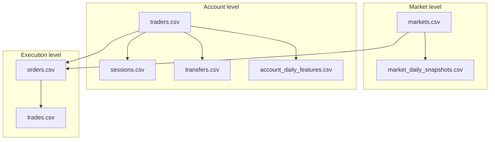

# Fraud Detection Assignment Plan

## Translation check: German vs English

**Verdict: The English translation is correct and complete for all assignment content.** You can rely on [task_english.txt](task_english.txt) for instructions.

| Section | Status |
|---------|--------|
| Objective, data model, 5 tasks | Accurate |
| Field glossary (all 8 tables) | Accurate |
| Typical patterns, Python hints, submission format | Present and accurate |

**Minor issues (formatting only, not meaning):**
- PDF artifacts: stray page numbers (`1`, `2`, `3`…) and a broken list in Task 1 (`2. 3. 4.` on one line) — the four concrete steps are still all there.
- One line break mid-sentence around `shared_device_session_share` (Task 4) — content intact.

**Terminology spot-check (all fine):**
- *belastbare Verdachtswahrscheinlichkeiten* → “robust probabilities of suspicion” (not “proof”)
- *Gegenhypothese* → “counter-hypothesis”
- *informationsgetriebenen Missbrauch* → “information-driven abuse”
- *Spoofing*, *Kollusion* → kept as standard fraud-analytics terms

**One practical gap:** Both texts mention optional `starter_analysis.py`, but **it is not in your workspace** — only CSVs in [polymarket_fraud_seminar_student (1)/](polymarket_fraud_seminar_student%20(1)/). Ask your professor or build from scratch using the Python hints in the task.

---

## What you are actually doing (big picture)

You are **not** proving fraud. You are building **evidence-based suspicion** by linking:



**Dataset scale (for planning time):**
- ~48 markets, ~360 traders
- ~8,000 orders, ~8,000 trades
- ~12,500 account-day feature rows

---

## Step-by-step: the 5 tasks in order

Follow the professor’s recommended sequence: tables → descriptives → patterns/clusters → score → write-up.

### Task 1 — Data understanding and quality (~15–20% of effort)

**Goal:** Prove you understand joins before hunting fraud.

1. Load all 8 CSVs from [polymarket_fraud_seminar_student (1)/](polymarket_fraud_seminar_student%20(1)/) with pandas; use [data_dictionary.csv](polymarket_fraud_seminar_student%20(1)/data_dictionary.csv) as a quick reference.
2. **Sketch a join plan** (diagram or bullet list):
   - `orders`: `trader_id` → `traders`, `market_id` → `markets`
   - `trades`: `market_id` → `markets`, `buyer_trader_id` / `seller_trader_id` → `traders`, `buy_order_id` / `sell_order_id` → `orders`
   - `sessions`, `transfers`, `account_daily_features`: `trader_id` → `traders`
   - `market_daily_snapshots`: `market_id` → `markets`
3. **Uniqueness checks:** `order_id`, `trade_id` should be unique; `market_id` and `trader_id` unique in dimension tables (not in fact tables).
4. **FK integrity:** Orphan `market_id` / `trader_id` in orders/trades?
5. **Missing values & duplicates** per table.
6. **Parse datetimes:** `created_at`, `updated_at`, `session_start`, `session_end`, `trade_ts`, `close_time`, etc.
7. **Temporal rules:** e.g. `created_at <= updated_at`, `session_start <= session_end`.
8. **Tag fields** as high / low / irrelevant fraud relevance (task glossary is your cheat sheet — ignore noise like `weather_temp_c`, `avatar_color`, `battery_pct_at_open`).

**Deliverable for Task 1:** Short data-model note + quality summary table.

---

### Task 2 — Suspicious markets (~25% of effort)

**Goal:** Markets where **price move ≠ participation breadth**.

Combine `market_daily_snapshots.csv`, `orders.csv`, `trades.csv`, and `markets.csv` (for `close_time`).

| Signal | How to compute (conceptually) |
|--------|-------------------------------|
| Thin market, big move | High `price_change_bps_sum` + low `unique_buyers` / `unique_sellers` |
| Spoofing at market level | High cancel rate from orders (`status == CANCELED`) per `market_id` |
| Account concentration | Few traders dominate volume in that market |
| Late manipulation | Aggressive trades near `close_time`: `near_close_minutes = (close_time - trade_ts)` small |

**Concrete outputs:**
- Price time series per market (pick most interesting markets, not all 48 if cluttered)
- Daily activity vs price change
- Cancel rate per market
- Counterparty concentration per market
- **Top-10 suspicious markets** with 1–2 sentence justification each

**Use counter-evidence fields:** `news_sentiment_score`, `social_mentions_1h` on snapshots — saves you from false positives later.

---

### Task 3 — Account clusters (~20% of effort)

**Goal:** Fraud is often **multi-account**, not lone wolves.

Use `traders.csv`, `sessions.csv`, `transfers.csv`, `account_daily_features.csv`.

**Link accounts when they share:**
- `device_id` or `device_fingerprint_hash` (sessions)
- `ip_address` / `ip_asn` (sessions)
- `source_or_destination_address` on withdrawals (transfers)
- Pre-computed flags in features: `shared_device_session_share`, `shared_fp_session_share`, `shared_withdraw_addr_share`, high `vpn_share` / `tor_share`

**Concrete outputs:**
- Account–account graph (edges = shared attribute; tool: NetworkX or simple adjacency table)
- Per cluster: size, density, **internal trade share** (trades where both sides in same cluster)
- **Top 3 suspicious clusters** with narrative

---

### Task 4 — Heuristic fraud score (~25% of effort)

**Goal:** Transparent, weighted score — **not** a black-box ML model.

**Account score — candidate features** (from `account_daily_features.csv`, aggregate or max over days):

| Feature | Suspicious when |
|---------|-----------------|
| `cancel_count` / `orders_placed` | High |
| `fill_ratio_mean` | Low |
| `top_counterparty_trade_share` | High |
| `shared_device_session_share`, `shared_fp_session_share`, `shared_withdraw_addr_share` | High |
| `api_order_share` | High |
| `self_trade_count` | High |

**Process:**
1. Standardize features (z-score or min-max)
2. Assign weights with **written justification** (e.g. self-trade and shared withdraw addr weighted higher than api_share alone)
3. Rank accounts; optionally build a **market-level score** from Task 2 metrics
4. Textually justify top 5–10 accounts (and markets if done)

**Starter metrics from the task:**

```python
fill_ratio = matched_size_shares / size_shares  # order level
cancel_to_order_ratio = cancel_count / orders_placed
shared_infra_score = shared_device_session_share + shared_fp_session_share + shared_withdraw_addr_share
near_close_minutes = (close_time - trade_ts).dt.total_seconds() / 60
```

---

### Task 5 — Interpretation and management summary (~10–15% of effort)

**Goal:** Show analytical maturity.

For each top case (3–5 accounts/markets):
- **What pattern** you see (collusion / spoofing / information-driven)
- **Why it’s suspicious** (data evidence)
- **Counter-hypothesis** (legitimate explanation): real news, illiquid market, API market-making, featured market / promo traffic
- Explicitly state: **suspicion ≠ proof**

**One-page management summary:** 3–5 cases, ranked, plain language for a non-technical reader.

---

## What to submit (from German/English spec)

| Deliverable | Requirement |
|-------------|-------------|
| Code | Short Jupyter notebook **or** Python script |
| Visuals | **2–4** meaningful plots (not decorative) |
| Tables | Top suspicious **accounts** and **markets** |
| Write-up | **~1 page** summary with justification + counter-hypotheses |

---

## Mindfulness checklist (common pitfalls)

1. **Do not treat single tables as proof** — suspicion comes from *joining* market + order + trade + session + transfer signals.
2. **Distinguish suspicion from proof** — required in Task 5; weakens your grade if missing.
3. **Always offer counter-hypotheses** — especially for markets with high `news_sentiment_score` or `featured_flag`.
4. **Ignore intentional noise fields** — `weather_temp_c`, `emoji_reaction_count`, `thumbnail_theme`, etc. are distractors.
5. **Shared IP ≠ automatic fraud** — universities, VPNs, corporate NAT; pair with fingerprint, device, withdraw addr.
6. **Young accounts + aggressive trading** — suspicious but not sufficient alone (`account_age_days`, `signup_ts`).
7. **Self-trades** — `is_self_trade_flag` and `self_trade_count` are strong but still need context.
8. **Timezones** — use `timezone_hint` on markets; parse all timestamps consistently (UTC recommended).
9. **Cancel vs spoofing** — high cancels + low fill ratio + high `replace_count_15m` / `cancel_count_15m` strengthens spoofing story.
10. **Document weights** — Task 4 is about *explainability*, not model accuracy.
11. **Join carefully** — trades link two traders; double-counting volume is a common mistake.
12. **starter_analysis.py** — optional; not in your folder, so don’t wait on it.

---

## Suggested project structure

```
data_science/
├── polymarket_fraud_seminar_student (1)/   # raw CSVs (read-only)
├── notebook/
│   └── fraud_analysis.ipynb               # or fraud_analysis.py
├── output/
│   ├── figures/                           # 2–4 plots
│   └── tables/                            # top_accounts.csv, top_markets.csv
└── report/
    └── management_summary.md              # export to PDF if required
```

---

## Time budget (solo or pair)

| Phase | Suggested time |
|-------|----------------|
| Task 1 — EDA & quality | 3–5 h |
| Task 2 — Markets | 4–6 h |
| Task 3 — Clusters | 3–5 h |
| Task 4 — Score | 4–6 h |
| Task 5 — Write-up + plots | 2–4 h |
| **Total** | **~16–26 h** |

---

## Implementation order (your execution checklist)

1. Set up Python env: `pandas`, `matplotlib`/`seaborn`, optional `networkx`.
2. Task 1 notebook section: load, profile, join diagram, QC.
3. Task 2: market metrics → top-10 table → 1–2 plots.
4. Task 3: build graph → cluster stats → top-3 clusters.
5. Task 4: standardize → weighted score → rank accounts/markets.
6. Task 5: merge findings → counter-hypotheses → 1-page summary.
7. Final pass: 2–4 best charts, export tables, proofread “suspicion vs proof” language.
