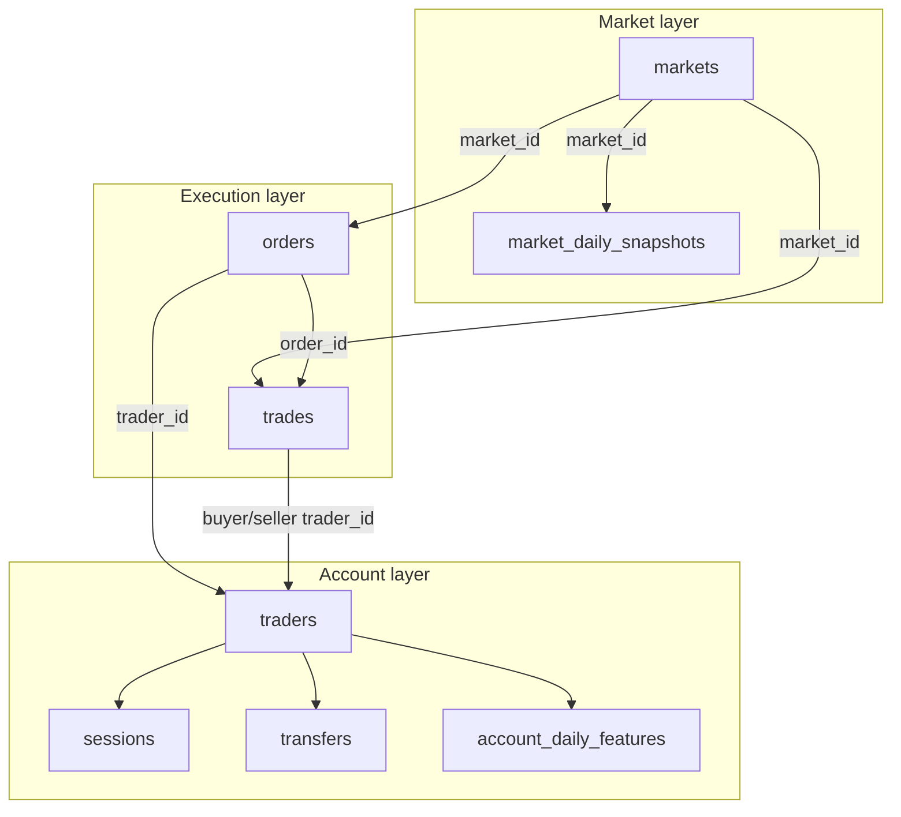

# Task 1 — PowerPoint summary 

---

## Slide 1 — Title

**Task 1: Data Understanding & Quality**  
Fraud Detection Seminar — Polymarket-style dataset  
[Pradip Baskota]

---

## Slide 2 — What is Task 1?

- **Goal:** Understand the data *before* looking for fraud
- We do **not** accuse anyone yet — we check if data is clean and how tables connect
- **Why it matters:** Fraud signals only appear when you **join** markets + accounts + orders + trades

---

## Slide 3 — Our 8 tables (3 layers)

| Layer | Tables | What it describes |
|-------|--------|-------------------|
| **Market** | markets, daily snapshots | Prediction markets & daily prices/volume |
| **Account** | traders, sessions, transfers, daily features | Users, devices, money in/out, risk metrics |
| **Execution** | orders, trades | Bets placed and trades executed |

**Size:** 48 markets · 360 traders · 8,000 orders · 7,977 trades

---

## Slide 4 — How tables connect (join plan)

**Easiest:** Insert image → `output/task1/task1_join_diagram.png` (ready-made for PowerPoint)

**Or copy this text diagram** (Text Box, monospace font e.g. Consolas 11pt):

```
                    ┌─────────────────────────────────────────┐
                    │           MARKET LAYER                  │
                    │  ┌──────────┐    ┌──────────────────┐  │
                    │  │ markets  │    │ daily snapshots  │  │
                    │  └────┬─────┘    └────────┬─────────┘  │
                    │       │    market_id      │            │
                    └───────┼───────────────────┼────────────┘
                            │                   │
                            ▼                   ▼
                    ┌─────────────────────────────────────────┐
                    │         EXECUTION LAYER                 │
                    │  ┌──────────┐         ┌──────────┐     │
                    │  │  orders  │◄───────►│  trades  │     │
                    │  └────┬─────┘ order_id └────┬─────┘     │
                    │       │    trader_id       │            │
                    └───────┼────────────────────┼────────────┘
                            │                    │
                            ▼                    ▼
                    ┌─────────────────────────────────────────┐
                    │          ACCOUNT LAYER                  │
                    │  ┌──────────┐                          │
                    │  │ traders  │◄─── trader_id ───────────┼──┐
                    │  └────┬─────┘                          │  │
                    │       │                                │  │
                    │   ┌───┴───┬───────────┬────────────┐  │  │
                    │   ▼       ▼           ▼            ▼  │  │
                    │ sessions transfers  daily features  │  │
                    │ (device, IP) (cash)  (risk scores)   │  │
                    └─────────────────────────────────────────┘  │
                                                                 │
              Join keys:  market_id · trader_id · order_id ◄────┘
```

**Join keys (bullet list under the diagram):**

- `market_id` → markets, orders, trades, snapshots  
- `trader_id` → traders, orders, sessions, transfers, features  
- `order_id` → orders ↔ trades (buy leg / sell leg)

**Key message:** One table alone is not enough — teammates combine layers in Tasks 2–4.

<details>
<summary>Optional: Mermaid version (export at mermaid.live → PNG for PowerPoint)</summary>



</details>

---

## Slide 5 — Quality checks (results)

| Check | Result |
|-------|--------|
| Duplicate IDs? | **No** — every order, trade, trader, market ID is unique |
| Broken links (market/trader)? | **0 orphans** |
| Time logic (start before end)? | **All OK** |
| Missing values? | Some columns empty **on purpose** (e.g. cancel reason only when order canceled) |

---

## Slide 6 — Which columns matter for fraud?

| Relevance | Examples |
|-----------|----------|
| **High** | cancel_reason, is_api_order, device fingerprint, shared withdrawal address, self_trade_flag |
| **Medium** | news_sentiment (can explain price moves — not always fraud) |
| **Ignore** | weather_temp_c, avatar_color, battery % — noise fields |

---

## Slide 7 — Conclusion & handover

1. Data is **consistent** and **ready** for analysis  
2. Fraud detection = **joining** market + account + trading data  
3. **Next tasks (team):** suspicious markets (Task 2), account clusters (Task 3), risk score (Task 4)

**Script:** `task1_data_understanding.py`  
**Outputs:** `output/task1/` folder (CSV + summary + `task1_join_diagram.png`)

---

## Speaker notes (30 sec each)

- **Slide 2:** “We’re the foundation — if the data is wrong, everything else is wrong.”
- **Slide 4:** Walk through the diagram top-down: Market → Execution → Account; point at `market_id` and `trader_id` arrows.
- **Slide 5:** Emphasize 0 orphans for market_id and trader_id — data is trustworthy.
- **Slide 7:** Hand off to teammate doing market patterns: “Use market_id to join snapshots and orders.”
